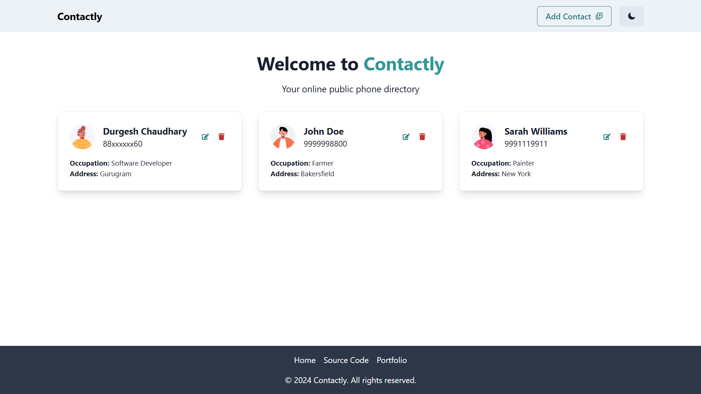

# Contactly - An Online Phonebook Directory

Contactly is a simple online phonebook directory that allows users to store and manage contacts at a single place. It supports full CRUD functionality where users can add, edit, and delete contacts from the directory. The directory is public and can be accessed by anyone with the link.

The application is built using JavaScript for the frontend with React.js as the UI library and Python for the backend with Flask as the web framework.

## Live Preview

Please visit [Contactly - Live](https://contactly-bjxv.onrender.com) to see the site's live preview.



## Getting Started

To get a local copy up and running follow these simple steps:

1. Clone the repository:

   ```bash
   git clone https://github.com/yodkwtf/contactly-react-flask.git
   ```

2. Move into the project directory:

   ```bash
   cd contactly-react-flask
   ```

3. Install the dependencies:

   ```bash
   # Install the dependencies for the client
   cd client && npm install

   # Install the dependencies for the server
   cd ../server && pip install -r requirements.txt
   ```

4. Run the development server:

   ```bash
   # Start the client
   cd client && npm start

   # Start the server
   cd ../server && flask run
   ```

5. Open your browser and visit [http://localhost:3000](http://localhost:3000) to see the application running.

_**Note**: Make sure to create a virtual environment for the server and activate it before running it. The [notes.md](./notes.md) file provides the instructions to create a virtual environment._

## Contributing

As of now, I do not have any plans to add any more enhancements to this project. However, if you would like to contribute to the project, feel free to fork the repository and submit a pull request.

Also, please check out the [issues section](https://github.com/yodkwtf/contactly-react-flask/issues) to see the list of known issues and enhancements that can be resolved.

## Contact

- **Email:** [48durgesh.kumar@gmail.com](mailto:48durgesh.kumar@gmail.com)
- **LinkedIn:** [Durgesh Chaudhary](https://www.linkedin.com/in/durgesh-chaudhary/)
- **GitHub:** [@yodkwtf](https://github.com/yodkwtf)
